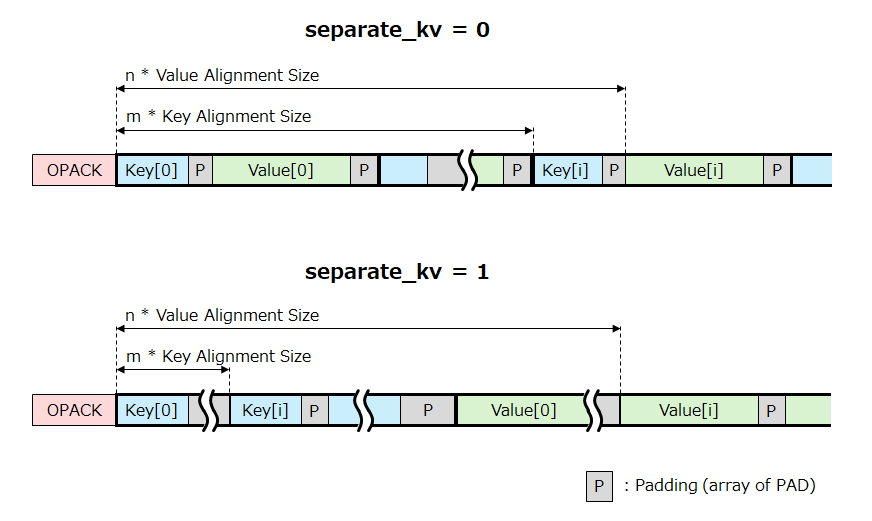

# BlobBulb (WIP)

universal binary data container.

----

## Syntax

A BlobBulb document consists of a set of "token".

```abnf
document = DOCSTA [ <meta-object> ] [ <variant> ] DOCEND

variant = <array> | <object> | <primitive>

array = <unpacked-array> | <packed-array>
unpacked-array = ARYSTA [ <meta-object> ] *<variant> BLKEND
packed-array = APACK [ <meta-object> ] <blob>

object = <unpacked-object> | <packed-object>
unpacked-object = OBJSTA [ <meta-object> ] *( <object-key> <variant> ) BLKEND
packed-object = OPACK [ <meta-object> ] <blob>
object-key = <number> | <string>

meta-object = META <object>

primitive = <number> | <boolean> | <string> | <blob> | TIME | NULL

number = <unsigned-integer> | <signed-integer> | <float>
unsigned-integer = U8 | U16 | U32 | U64 | U6Dxx
signed-integer = S8 | S16 | S32 | S64
float = FP32 | FP64

boolean = BOOL | FALSE | TRUE

string = STR1L | STR2L | STR4L | STR8L | STR4B
blob = BLOB1L | BLOB2L | BLOB4L | BLOB8L
```

- No tokens can be placed before `DOCSTA`.
- No tokens can be placed after `DOCEND`.

----

## Token Format

### Fixed Length Token

|Offset|Single|Scalar1|Scalar2|Scalar4|Scalar8|
|:--:|:--:|:--:|:--:|:--:|:--:|
|+0|`OPCODE`|`OPCODE`|`OPCODE`|`OPCODE`|`OPCODE`|
|+1|-|`VALUE`|`VALUE[7:0]`|`VALUE[7:0]`|`VALUE[7:0]`|
|+2|-|-|`VALUE[15:8]`|`VALUE[15:8]`|`VALUE[15:8]`|
|+3|-|-|-|`VALUE[23:16]`|`VALUE[23:16]`|
|+4|-|-|-|`VALUE[31:24]`|`VALUE[31:24]`|
|+5|-|-|-|-|`VALUE[39:32]`|
|+6|-|-|-|-|`VALUE[47:40]`|
|+7|-|-|-|-|`VALUE[55:48]`|
|+8|-|-|-|-|`VALUE[63:56]`|

### Valiable Length Token

|Offset|ByteSeq1L|ByteSeq2L|ByteSeq4L|ByteSeq8L|
|:--:|:--:|:--:|:--:|:--:|
|+0|`OPCODE`|`OPCODE`|`OPCODE`|`OPCODE`|
|+1|`SIZE`|`SIZE[7:0]`|`SIZE[7:0]`|`SIZE[7:0]`|
|+2|`BYTE[0]`|`SIZE[15:8]`|`SIZE[15:8]`|`SIZE[15:8]`|
|+3|`BYTE[1]`|`BYTE[0]`|`SIZE[23:16]`|`SIZE[23:16]`|
|+4|`BYTE[2]`|`BYTE[1]`|`SIZE[31:24]`|`SIZE[31:24]`|
|+5|:|`BYTE[2]`|`BYTE[0]`|`SIZE[39:32]`|
|+6|:|:|`BYTE[1]`|`SIZE[47:40]`|
|+7|:|:|`BYTE[2]`|`SIZE[55:48]`|
|+8|:|:|:|`SIZE[63:56]`|
|+9|:|:|:|`BYTE[0]`|
|+10|:|:|:|`BYTE[1]`|
|:|:|:|:|`BYTE[2]`|
|:|:|:|:|:|
|:|:|:|:|:|
||`BYTE[SIZE-1]`|`BYTE[SIZE-1]`|`BYTE[SIZE-1]`|`BYTE[SIZE-1]`|

## OpCode Map

- Empty cell: Reserved for future use.

|`OPH\L`|+0x0|+0x1|+0x2||+0x8||+0xC|+0xD||+0xF|Shape|
|:--:|:--:|:--:|:--:|:--:|:--:|:--:|:--:|:--:|:--:|:--:|:--:|
|0x00|||||||||||reserved|
|0x10|||||||||||reserved|
|0x20|`NULL`||||||`ARYSTA`|`OBJSTA`|||Single|
|0x30|`FALSE`|`TRUE`|||||`BLKEND`|`META`||`PAD`|Single|
|0x40|`U6D00`|`U6D01`|...||...||...|...||`U6D0F`|Single|
|0x50|`U6D10`|`U6D11`|...||...||...|...||`U6D1F`|Single|
|0x60|`U6D20`|`U6D21`|...||...||...|...||`U6D2F`|Single|
|0x70|`U6D30`|`U6D31`|...||...||...|...||`U6D3F`|Single|
|0x80|`U8`|`S8`|`BOOL`||||`APACK`||||Scalar1|
|0x90|`U16`|`S16`|||||`OPACK`||||Scalar2|
|0xA0|`U32`|`S32`|`STR4B`||`F32`||||||Scalar4|
|0xB0|`U64`|`S64`|`TIME`||`F64`||`DOCSTA`|`DOCEND`|||Scalar8|
|0xC0|`BLOB1L`|`STR1L`|||||`CMNT1L`||||ByteSeq1L|
|0xD0|`BLOB2L`|`STR2L`|||||`CMNT2L`||||ByteSeq2L|
|0xE0|`BLOB4L`|`STR4L`|||||||||ByteSeq4L|
|0xF0|`BLOB8L`|`STR8L`|||||||||ByteSeq8L|

----

## Document Level Tokens

### Document Start (`DOCSTA`)

|Offset|Mnemonic|Description|
|:--:|:--:|:--|
|+0|`DOCSTA`|See OpCode Map|OpCode|
|+1|`MARKER[7:0]`|0x42 (`'B'`)|
|+2|`MARKER[15:8]`|0x6c (`'l'`)|
|+3|`MARKER[23:16]`|0x4c (`'L'`)|
|+4|`MARKER[31:24]`|0x62 (`'b'`)|
|+5|`format_version`|Format Version Number|
|+6|`format_flags`|Flags|
|+7|-|reserved|
|+8|-|reserved|

#### Version (`format_version`)

`0x01`

#### Flags (`format_flags`)

|Bit Range|Mnemonic|Description|
|:--:|:--:|:--|
|\[7\]|`enable_crc`|CRC Enable|
|\[6:0\]|-|reserved|

### Document End (`DOCEND`)

|Offset|Mnemonic|Description|
|:--:|:--:|:--|
|+0|`DOCEND`|OpCode|
|+1|-|reserved|
|+2|-|reserved|
|+3|-|reserved|
|+4|-|reserved|
|+5|`crc[7:0]`|CRC|
|+6|`crc[15:8]`|CRC|
|+7|`crc[23:16]`|CRC|
|+8|`crc[31:24]`|CRC|

#### CRC (`crc`)

|Condition|Value of CRC|
|:--:|:--|
|`enable_crc` = 0|`0x00000000`|
|`enable_crc` = 1|CRC Value|

- CRC calculation must be performed on all bytes from the beginning of `DOCSTA` to before `CRC` field (including padding and comments).
- Polynomial for CRC: `0x04c11db7`.

----

## Array / Object Packing

### Packed Array (`APACK`)

|Offset|Mnemonic|Description|
|:--:|:--:|:--|
|+0|`APACK`|OpCode|
|+1|`value_packing_arg`|Value Packing Argument|

#### `value_packing_arg`

|Bit Range|Mnemonic|Description|
|:--:|:--:|:--|
|7:6|`value_align_size`|Aligment Size|
|5:0|`val_type`|Value Type|

#### `value_align_size`

|Value|Aligment Boundary|
|:--:|:--|
|0|No aligmnent|
|1|2 Byte boundary|
|2|4 Byte boundary|
|3|8 Byte boundary|

#### `val_type`

|`val_type[3:0]`|OpCode|
|:--:|:--:|
|0x0-B|`val_type` + 0x80 (128)|
|0xC-F|`val_type` + 0xB4 (180)|

### Packed Object (`OPACK`)

|Offset|Mnemonic|Description|
|:--:|:--:|:--|
|+0|`OPACK`|OpCode|
|+1|`key_packing_arg`|Key Packing Argument|
|+2|`value_packing_arg`|Value Packing Argument|

#### `key_packing_arg`

|Bit Range|Mnemonic|Description|
|:--:|:--:|:--|
|7:6|`key_align_size`|Aligment Size|
|5|`separate_kv`|Make keys and value into separate chunks|
|4|reserved|
|3:0|`key_type`|Value Type|

#### `key_align_size`

See table of `value_align_size`.

Alignment is performed based on the beginning of the blob data, not the beginning of the document.



#### `key_type`

|`key_type[1:0]`|Key Type|
|:--:|:--:|
|0x0|`U8`|
|0x1|`U16`|
|0x2|`U32`|
|0x3|`U64`|
|0x4|`S8`|
|0x5|`S16`|
|0x6|`S32`|
|0x7|`S64`|
|0x8|reserved|
|0x9|reserved|
|0xA|`STR4B`|
|0xB|reserved|
|0xC|`STR1L`|
|0xD|`STR2L`|
|0xE|`STR4L`|
|0xF|`STR8L`|

----

## POT Primitive Value

### Integer (`Un`, `In`)

- `n` = 8, 16, 32, or 64

|Offset|U8, S8|U16, S16|U32, S32|U64, S64|Description|
|:--:|:--:|:--:|:--:|:--:|:--|
|+0|`TID`|`TID`|`TID`|`TID`|OpCode|
|+1|`value[7:0]`|`value[7:0]`|`value[7:0]`|`value[7:0]`|Value|
|+2||`value[15:8]`|`value[15:8]`|`value[15:8]`|Value|
|+3|||`value[23:16]`|`value[23:16]`|Value|
|+4|||`value[31:24]`|`value[31:24]`|Value|
|+5||||`value[39:32]`|Value|
|+6||||`value[47:40]`|Value|
|+7||||`value[55:48]`|Value|
|+8||||`value[63:56]`|Value|

- `value`: unsigned/signed integer value (two's complement)

### Floating Point (`Fn`)

- `n` = 32 or 64

|Offset|F32|F64|Description|
|:--:|:--:|:--:|:--|
|+0|`TID`|`TID`|OpCode|
|+1|`value[7:0]`|`value[7:0]`|Value|
|+2|`value[15:8]`|`value[15:8]`|Value|
|+3|`value[23:16]`|`value[23:16]`|Value|
|+4|`value[31:24]`|`value[31:24]`|Value|
|+5||`value[39:32]`|Value|
|+6||`value[47:40]`|Value|
|+7||`value[55:48]`|Value|
|+8||`value[63:56]`|Value|

- `value`: floating point value (IEEE754)

### Boolean (`BOOL`, `FALSE`, `TRUE`)

|Offset|Mnemonic|Description|
|:--:|:--:|:--|
|+0|`BOOL`|OpCode|
|+1|`value`|Value|

|`value`|Description|
|:--:|:---|
|0x00|value of false|
|0x01-0xff|value of true|

- `FALSE` and `TRUE` are shortened forms of `BOOL`.

### Date Time (`TIME`)

|Offset|Mnemonic|Description|
|:--:|:--:|:--|
|+0|`TIME`|OpCode|
|+1|`unix_time[7:0]`|UNIX time|
|+2|`unix_time[15:8]`|UNIX time|
|+3|`unix_time[23:16]`|UNIX time|
|+4|`unix_time[31:24]`|UNIX time|
|+5|`unix_time[39:32]`|UNIX time|
|+6|`unix_time[47:40]`|UNIX time|
|+7|`unix_time[55:48]`|UNIX time|
|+8|-|reserved|

- `unix_time`:
    - UNIX time in milliseconds
    - 56 bit signed integer

----

## Non-POT Primitive

### Blob (`BLOBnL`)

- Arbitrary byte sequence.

### Variable Length String (`STRnL`)

- Byte array of UTF-8.

### 4-Byte String (`STR4B`)

- US-ASCII string.
- `"xyz"` is same as `0x007a7978`.
- All unused bytes must be filled with `0x00`.

|Length|Byte\[0\]|Byte\[1\]|Byte\[2\]|Byte\[3\]|
|:--:|:--:|:--:|:--:|:--:|
|0|`0x00`|`0x00`|`0x00`|`0x00`|
|1|Char\[0\]|`0x00`|`0x00`|`0x00`|
|2|Char\[0\]|Char\[1\]|`0x00`|`0x00`|
|3|Char\[0\]|Char\[1\]|Char\[2\]|`0x00`|
|4|Char\[0\]|Char\[1\]|Char\[2\]|Char\[3\]|

### Null (`NULL`)

- Same as `null` of JavaScript.

----

## Padding and Comments

- Padding and comments can be placed between any tokens. They must not be placed before `DOCSTA` and after `DOCEND`.
- Padding and comments must be skipped during the parsing.

### Padding (`PAD`)

- Can be used for data alignment.

### Comment (`CMNTnL`)

- Byte array of UTF-8.

----

#### Pre-defined Meta Data IDs

|Identifier|Description|
|:--:|:--|
|0-63|Reserved|
|others|User Defined|

----
