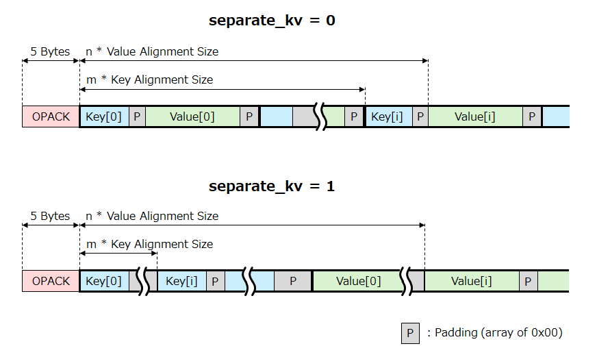

<p align="center"></p>
<h1 align="center">BlobBulb (WIP)</h1>
<p align="center">a universal binary data container format.</p>

----

## Syntax

A BlobBulb document consists of a set of "token".

```abnf
document = DOCSTA [ <dictionary> ] [ <body> ] DOCEND

dictionary = DICT OBJSTA *( <dictionary-key> <dictionary-value> ) BLKEND
dictionary-key = U6Dxx | U8 | U16
dictionary-value = STR1X

body = [ <meta-object> ] BODY [ <variant> ]

variant = <array> | <object> | <primitive>

array = <unpacked-array> | <packed-array>
unpacked-array = [ <meta-object> ] ARYSTA *<variant> BLKEND
packed-array = [ <meta-object> ] APACK

object = <unpacked-object> | <packed-object>
unpacked-object = [ <meta-object> ] OBJSTA *( <object-key> <variant> ) BLKEND
object-key = <number> | <string>
packed-object = [ <meta-object> ] OPACK

primitive = <number> | <boolean> | <time> | <string> | <blob> | <null>

number = <unsigned-integer> | <signed-integer> | <float>
unsigned-integer = [ <meta-object> ] ( U6Dxx | U8 | U16 | U32 | U64 )
signed-integer = [ <meta-object> ] ( I8 | I16 | I32 | I64 )
float = [ <meta-object> ] ( FP32 | FP64 )

boolean = [ <meta-object> ] ( BOOL | FALSE | TRUE )
time = [ <meta-object> ] TIME
null = [ <meta-object> ] NULL

string = <short-string> | <variable-length-string> | <string-dictionary-reference>
short-string = [ <meta-object> ] ( STR1B | STR2B | STR4B | STR8B )
variable-length-string = [ <meta-object> ] ( STR1X | STR2X | STR4X | STR8X )
string-dictionary-reference = [ <meta-object> ] ( SREF8 | SREF16 )

blob = [ <meta-object> ] ( BLOB1X | BLOB2X | BLOB4X | BLOB8X )

meta-object = META <object>
```

- No tokens can be placed before `DOCSTA`.
- No tokens can be placed after `DOCEND`.

----

## Token Format

### Fixed Length Token

|Offset|Single|Scalar1|Scalar2|Scalar4|Scalar8|
|:--:|:--:|:--:|:--:|:--:|:--:|
|+0|`opcode`|`opcode`|`opcode`|`opcode`|`opcode`|
|+1|-|`value`|`value[7:0]`|`value[7:0]`|`value[7:0]`|
|+2|-|-|`value[15:8]`|`value[15:8]`|`value[15:8]`|
|+3|-|-|-|`value[23:16]`|`value[23:16]`|
|+4|-|-|-|`value[31:24]`|`value[31:24]`|
|+5|-|-|-|-|`value[39:32]`|
|+6|-|-|-|-|`value[47:40]`|
|+7|-|-|-|-|`value[55:48]`|
|+8|-|-|-|-|`value[63:56]`|

### Valiable Length Token

|Offset|ByteSeq1|ByteSeq2|ByteSeq4|ByteSeq8|
|:--:|:--:|:--:|:--:|:--:|
|+0|`opcode`|`opcode`|`opcode`|`opcode`|
|+1|`size`|`size[7:0]`|`size[7:0]`|`size[7:0]`|
|+2|`data[0]`|`size[15:8]`|`size[15:8]`|`size[15:8]`|
|+3|`data[1]`|`data[0]`|`size[23:16]`|`size[23:16]`|
|+4|`data[2]`|`data[1]`|`size[31:24]`|`size[31:24]`|
|+5|:|`data[2]`|`data[0]`|`size[39:32]`|
|+6|:|:|`data[1]`|`size[47:40]`|
|+7|:|:|`data[2]`|`size[55:48]`|
|+8|:|:|:|`size[63:56]`|
|+9|:|:|:|`data[0]`|
|+10|:|:|:|`data[1]`|
|:|:|:|:|`data[2]`|
|:|:|:|:|:|
|:|:|:|:|:|
||`data[size-1]`|`data[size-1]`|`data[size-1]`|`data[size-1]`|

## OpCode Map

- Empty cell: Reserved for future use

|`opcode`<br>(H\\L)|+0x0|+0x1|+0x2|+0x3||+0x8||+0xB|+0xC|+0xD|+0xE|+0xF|Shape|
|:--:|:--:|:--:|:--:|:--:|:--:|:--:|:--:|:--:|:--:|:--:|:--:|:--:|:--:|
|0x00|||||||||||||reserved|
|0x10|||||||||`BODY`|||`PAD`|Single|
|0x20|`NULL`||||||||`ARYSTA`|`OBJSTA`|||Single|
|0x30|`FALSE`|`TRUE`|||||||`BLKEND`|`DICT`|`META`||Single|
|0x40|`U6D00`|`U6D01`|...|...||...||...|...|...|...|`U6D0F`|Single|
|0x50|`U6D10`|`U6D11`|...|...||...||...|...|...|...|`U6D1F`|Single|
|0x60|`U6D20`|`U6D21`|...|...||...||...|...|...|...|`U6D2F`|Single|
|0x70|`U6D30`|`U6D31`|...|...||...||...|...|...|...|`U6D3F`|Single|
|0x80|`U8`|`I8`|`BOOL`|`STR1B`||||`SREF8`|||||Scalar1|
|0x90|`U16`|`I16`||`STR2B`||||`SREF16`|`APACK`||||Scalar2|
|0xA0|`U32`|`I32`||`STR4B`||`F32`|||`OPACK`||||Scalar4|
|0xB0|`U64`|`I64`|`TIME`|`STR8B`||`F64`|||`DOCSTA`|`DOCEND`|||Scalar8|
|0xC0|`BLOB1X`|`STR1X`|||||||||`CMNT1X`|`PAD1X`|ByteSeq1|
|0xD0|`BLOB2X`|`STR2X`|||||||||`CMNT2X`|`PAD2X`|ByteSeq2|
|0xE0|`BLOB4X`|`STR4X`|||||||||||ByteSeq4|
|0xF0|`BLOB8X`|`STR8X`|||||||||||ByteSeq8|

----

## Document Level Tokens

### Document Start (`DOCSTA`)

|Offset|Mnemonic|Description|
|:--:|:--:|:--|
|+0|`DOCSTA`|See OpCode Map|OpCode|
|+1|`MARKER[7:0]`|0x42 (`'B'`)|
|+2|`MARKER[15:8]`|0x6c (`'l'`)|
|+3|`MARKER[23:16]`|0x4c (`'L'`)|
|+4|`MARKER[31:24]`|0x62 (`'b'`)|
|+5|`format_version`|Format Version Number|
|+6|`format_flags`|Flags|
|+7|-|reserved|
|+8|-|reserved|

#### Version (`format_version`)

|Version|Description|
|:--:|:--|
|0x01|v0.1: experimental version|

#### Flags (`format_flags`)

|Bit Range|Mnemonic|Description|
|:--:|:--:|:--|
|\[7\]|`enable_crc`|CRC enable|
|\[6:0\]|-|reserved|

### Document End (`DOCEND`)

|Offset|Mnemonic|Description|
|:--:|:--:|:--|
|+0|`DOCEND`|OpCode|
|+1|-|reserved|
|+2|-|reserved|
|+3|-|reserved|
|+4|-|reserved|
|+5|`crc[7:0]`|CRC|
|+6|`crc[15:8]`|CRC|
|+7|`crc[23:16]`|CRC|
|+8|`crc[31:24]`|CRC|

#### CRC (`crc`)

|Condition|Value of CRC|
|:--:|:--|
|`enable_crc` = 0|`0x00000000`|
|`enable_crc` = 1|CRC value|

- CRC calculation must be performed on all bytes from the beginning of `DOCSTA` to before `CRC` field (including padding and comments).
- Polynomial for CRC: `0x04c11db7`.

----

## Array / Object Packing

### Packed Array (`APACK`)

|Offset|Mnemonic|Description|
|:--:|:--:|:--|
|+0|`APACK`|OpCode|
|+1|`array_packing_flags`|array packing flags|
|+2|`type_info`|common type information of all elements|

#### `type_info`

|Bit Range|Mnemonic|Description|
|:--:|:--:|:--|
|7:6|-|reserved|
|5:0|`opcode_offset`|aligment size|

- `opcode_offset[3:0]` must be in the range 0x0 to 0xB.
- (0x80 + `opcode_offset`) is used as the actual OpCode.

#### `array_packing_flags`

|Bit Range|Mnemonic|Description|
|:--:|:--:|:--|
|7:2|-|reserved|
|1:0|`alignment_size`|aligment size|

#### `alignment_size`

|Value|Aligment Boundary|
|:--:|:--|
|0|No aligmnent|
|1|2 byte boundary|
|2|4 byte boundary|
|3|8 byte boundary|

### Packed Object (`OPACK`)

|Offset|Mnemonic|Description|
|:--:|:--:|:--|
|+0|`OPACK`|OpCode|
|+1|`object_packing_flags[7:0]`|object packing flags|
|+2|`object_packing_flags[15:8]`|object packing flags|
|+3|`key_type_info`|common type information of all keys|
|+4|`value_type_info`|common type information of all values|

#### `key_type_info`, `value_type_info`

See table of `array_packing_flags.type_info`.

#### `object_packing_flags`

|Bit Range|Mnemonic|Description|
|:--:|:--:|:--|
|15:6|-|reserved|
|7:4|`layout_mode`|contents layout mode|
|3:2|`value_alignment_size`|value aligment size|
|1:0|`key_alignment_size`|key aligment size|

#### `value_alignment_size`, `key_alignment_size`

See table of `array_packing_flags.alignment_size`.

Alignment is performed based on the beginning of the blob data, not the beginning of the document.



----

## POT Primitive Value

### Integer (`Un`, `In`)

- `n` = 8, 16, 32, or 64

|Offset|U8, I8|U16, I16|U32, I32|U64, I64|Description|
|:--:|:--:|:--:|:--:|:--:|:--|
|+0|`TID`|`TID`|`TID`|`TID`|OpCode|
|+1|`value[7:0]`|`value[7:0]`|`value[7:0]`|`value[7:0]`|value|
|+2||`value[15:8]`|`value[15:8]`|`value[15:8]`|value|
|+3|||`value[23:16]`|`value[23:16]`|value|
|+4|||`value[31:24]`|`value[31:24]`|value|
|+5||||`value[39:32]`|value|
|+6||||`value[47:40]`|value|
|+7||||`value[55:48]`|value|
|+8||||`value[63:56]`|value|

- `value`: unsigned/signed integer value (two's complement)

### Floating Point (`Fn`)

- `n` = 32 or 64

|Offset|F32|F64|Description|
|:--:|:--:|:--:|:--|
|+0|`TID`|`TID`|OpCode|
|+1|`value[7:0]`|`value[7:0]`|value|
|+2|`value[15:8]`|`value[15:8]`|value|
|+3|`value[23:16]`|`value[23:16]`|value|
|+4|`value[31:24]`|`value[31:24]`|value|
|+5||`value[39:32]`|value|
|+6||`value[47:40]`|value|
|+7||`value[55:48]`|value|
|+8||`value[63:56]`|value|

- `value`: floating point value (IEEE754)

### Boolean (`BOOL`, `FALSE`, `TRUE`)

|Offset|Mnemonic|Description|
|:--:|:--:|:--|
|+0|`BOOL`|OpCode|
|+1|`value`|Value|

|`value`|Description|
|:--:|:---|
|0x00|value of false|
|0x01-0xff|value of true|

- `FALSE` and `TRUE` are shortened forms of `BOOL`.

### Date Time (`TIME`)

|Offset|Mnemonic|Description|
|:--:|:--:|:--|
|+0|`TIME`|OpCode|
|+1|`unix_time[7:0]`|UNIX time|
|+2|`unix_time[15:8]`|UNIX time|
|+3|`unix_time[23:16]`|UNIX time|
|+4|`unix_time[31:24]`|UNIX time|
|+5|`unix_time[39:32]`|UNIX time|
|+6|`unix_time[47:40]`|UNIX time|
|+7|`unix_time[55:48]`|UNIX time|
|+8|-|reserved|

- `unix_time`:
    - UNIX time in milliseconds
    - 56 bit signed integer

----

## Non-POT Primitive

### Blob (`BLOBnL`)

- Arbitrary byte sequence.

### Variable Length String (`STRnL`)

- Byte array of UTF-8.

### Short String (`STRnB`)

- NULL-terminated string.
- All unused bytes must be filled with NULL (`0x00`).
- If there is no NULL byte, it is the same size as the number of bytes in `data`.

#### Valid Example

|Value|Length|`STR1B`|`STR2B`|`STR4B`|`STR8B`|
|:--|:--:|:--:|:--:|:--:|:--:|
|`""`|0|0x00|0x0000|0x00000000|0x0000000000000000|
|`"a"`|0|0x61|0x0061|0x00000061|0x0000000000000061|
|`"ab"`|0|-|0x6261|0x00006261|0x0000000000006261|
|`"abcd"`|0|-|-|0x64636261|0x0000000064636261|
|`"abcdefgh"`|0|-|-|-|0x6867666564636261|

#### Invalid Example

- 0x00626100
- 0x62000061

### Dictionary Reference (`SREF8`, `SREF16`)

#### Pre-defined Strings

|Key|String Value|
|:--:|:--|
|0-127|reserved|

### Null (`NULL`)

- Same as `null` of JavaScript.

----

## Padding and Comments

- Padding and comments can be placed between any tokens. They must not be placed before `DOCSTA` and after `DOCEND`.
- Padding and comments must be skipped during the parsing.

### Padding (`PAD`, `PADnX`)

- Can be used for data alignment.
- All values of `data` of `PADnX` must be 0x00 and they must not have any meaning.

### Comment (`CMNTnX`)

- Byte array of UTF-8.

----
